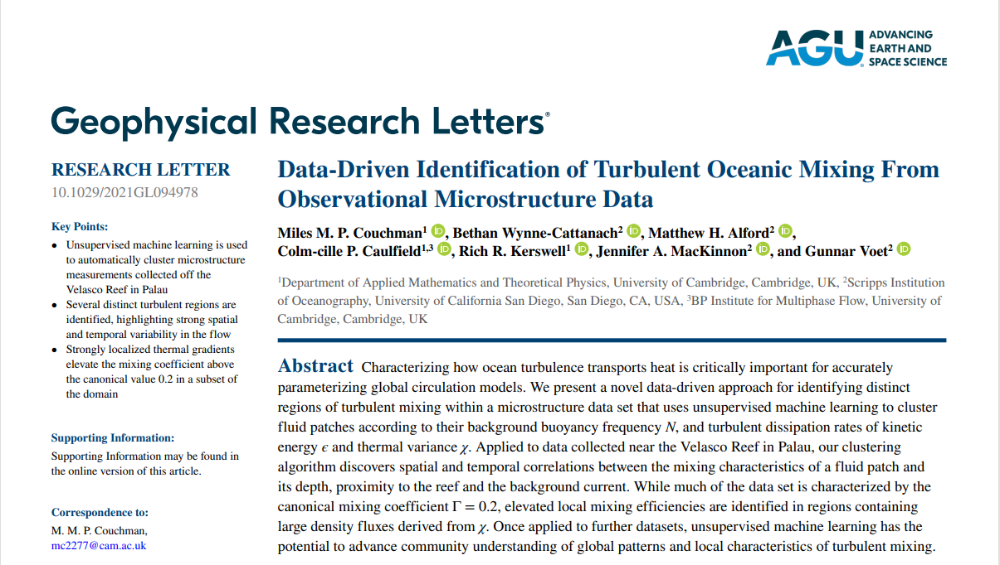

# OPTICS Reproduction and Parameter Tuning
This project reproduces the application of the OPTICS density clustering algorithm to the analysis of ocean microstructure observation data, and conducts comparative parameter adjustments, aiming to automatically identify water masses or turbulent states with distinct physical characteristics.

## Project Structure
- `optics_final.py`: Main code for OPTICS reproduction, clustering and parameter tuning

## Environment
- Python 3.x
- scikit‑learn, numpy, matplotlib

## Dataset
This project uses ocean microstructure observation data for OPTICS clustering analysis.
Raw dataset: [Ocean‑Microstructure‑Observation‑Dataset](https://pan.baidu.com/s/1JkAZcloi1SbaxXhkxnBMsw?pwd=1111)

## Usage
Run `optics_final.py` directly to reproduce the clustering results.

